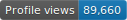

<h3 align="center">
   
<h3>

    <h4 align="center">"<em>Si lo puedes imaginar, lo puedes programar</em>"
      Alejandro Taboada Sanchez
    </h4>

- <h1>Hola cómo estan , Soy <a  href="https://github.com/Tatao1968/MARKDOWN-CURSO/blob/main/README.md"> Héctor Real </a> </h1>

- ###  Actualidad

-  Estoy estudiando en el Centro Integral de Formación Profesional a
Distancia ["La Conservera"](https://sites.google.com/view/fplaconservera) Región de Murcia
-  Formación Profesional de Grado Superior : técnico superior en Desarrollo de Aplicaciones Web.

- ###  Asignaturas Matriculadas:
<table align="center" face="courier">
  <tr style="background-color: rgb(102, 255, 153);">
    <th> Nº </th>
    <th> Asignatura </th>
    <th> Curso </th>
    <th> Duración </th>
  </tr>
  <tr>
    <td> 1 </td>
    <td> Base de Datos </td>
    <td> 1º de DAW </td>
    <td> 120 horas </td>
  </tr>
  <tr>
    <td>2</td>
    <td>Entornos de Desarrollo</td>
    <td>1º de DAW</td>
    <td>120 horas</td>
  <tr>
    </tr>
    <td>3</td><td>Inglés Profesional DAW</td><td>1º de DAW</td><td>120 horas</td>
  </tr>
<table/>

- <h3 align="left"> Stack Tecnológico del Curso:</h3>
<h3 align="left"  top="600"> Frameworks:</h3>
<a href="https://reactjs.org/" target="_blank">
 

<h3 align="left"> Base de Datos:</h3> 

## 🛠️ Mi Stack Tecnológico Conocido:
### <picture>   </picture> Programming languages

 
  &emsp; 
   
  &emsp;
  
  &emsp;
  
  &emsp;
   

### <picture>   </picture> Frontend Development

 
  &emsp; 
     
  &emsp;
   
  &emsp;
  
  &emsp;

 ### <picture>   </picture> Software & Tools
 

  &emsp;
    
  &emsp;
    
  &emsp;
    
  &emsp;
    
  &emsp;
    
  &emsp;
    

### ⚙️ &nbsp;GitHub Analytics

<h3 align="left" > 
Siguenos en redes sociales
 🤝 </h3>

-   

 <h3>Profile Views :-</h3> 

