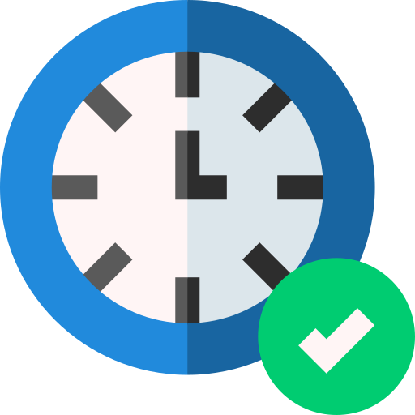

# Héctor Real Acosta  
***
##  Actualidad
***
-  Estoy estudiando en el Centro Integral de Formación Profesional a
Distancia ["La Conservera"](https://sites.google.com/view/fplaconservera) Región de Murcia
-  Formación Profesional de Grado Superior : técnico superior en Desarrollo de Aplicaciones Web.
- ###  Asignaturas Matriculadas:
<table face="courier">
  <tr style="background-color: rgb(102, 255, 153);">
    <th> Nº </th>
    <th> Asignatura </th>
    <th> Curso </th>
    <th> Duración </th>
  </tr>
  <tr>
    <td> 1 </td>
    <td> Base de Datos </td>
    <td> 1º de DAW </td>
    <td> 120 horas </td>
  </tr>
  <tr>
    <td>2</td>
    <td>Entornos de Desarrollo</td>
    <td>1º de DAW</td>
    <td>120 horas</td>
  <tr>
    </tr>
    <td>3</td><td>Inglés Profesional DAW</td><td>1º de DAW</td><td>120 horas</td>
  </tr>
<table/>

- ### Stack Tecnológico Conocido:

| `Multiplataforma `   | `Desarrollo web ` | `CI/CD - DevOps` | `Cloud`     |
|-----------------------|--------------------|--------------------|---------------|
| |  |  |  |
|  |  |  |
 

- ### Stack Tecnológico del Curso:
| Frameworks  | Bases de datos | 
|:---|:---|
| React |MongoDB|
| Node.js |Docker|
| Express ||

  
- ### Preferencias Tecnológicas
  - Frontend
  - Backend
  - Full-stack
  - Diseño UI/UX
  - Bases de datos
  - Analista de datos

- ## Siguenos en redes sociales
  -   
  

